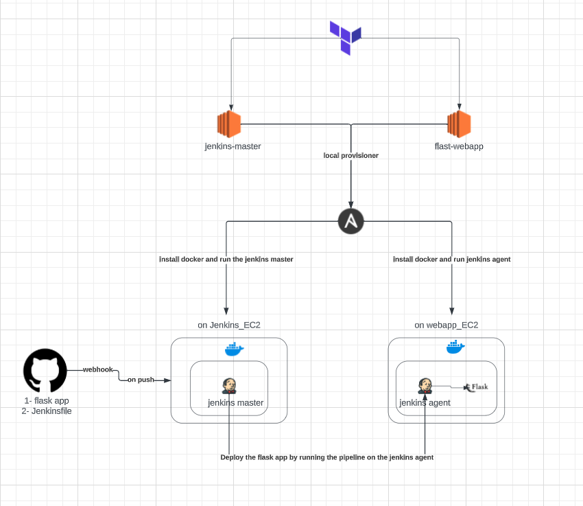
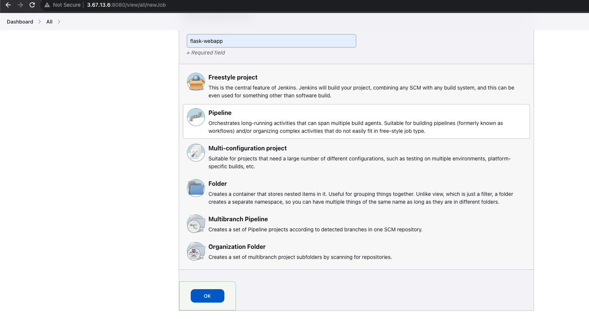
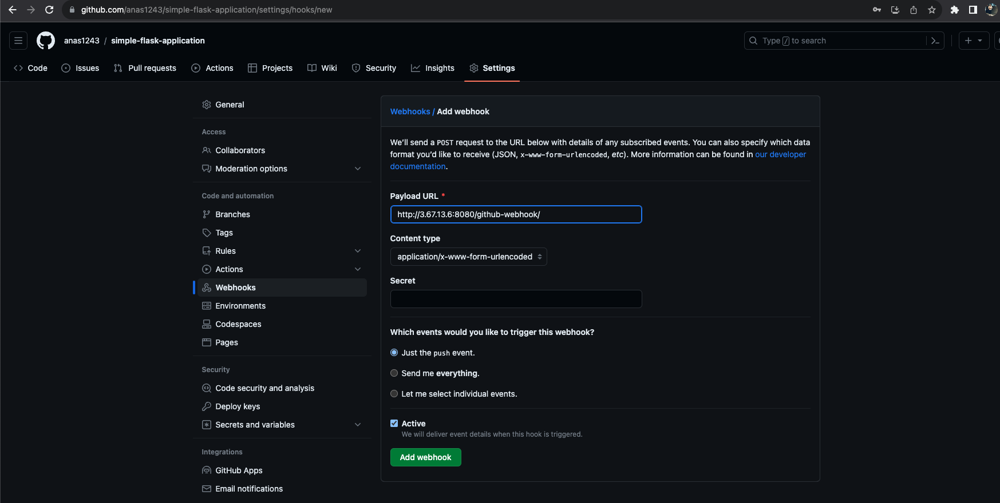

# Project Title

Provision and Configure Jenkins master and agent to deploy a dockerized simple flask application using Terraform, ansible, Docker, and Jenkins (controller and agent)

## Technology
     


## Project Diagram




## Description

This project aimed to integrate my knowledge in Docker, Terraform, Ansible, and Jenkins in one simple project.

This project is consists of two parts:

- Provision and configure the needed infrastructure for the jenkins controller, jenkins agent, and the flask webapp using terraform and Ansible.
- Build, and Deploy the python flask app on EC2 by running the Jenkins pipeline on the jenkins agent that is deployed as a container on the flask webapp Ec2 as container.

### Github Repositories
1- https://github.com/anas1243/jenkins-agent-deploy-flask-app

2- https://github.com/anas1243/simple-flask-application

3- https://github.com/anas1243/public-network-terraform-module

Network module that I'm using to provision simple vpc, gateways, and subnets for testing purposes. I only pass the variables values according to the use case.

## Getting Started

### Dependencies

In order to provision the infrastructure on aws and configure them using ansible you need the following softwares

* [Terraform](https://developer.hashicorp.com/terraform/tutorials/aws-get-started/install-cli)

* [Ansible](https://docs.ansible.com/ansible/latest/installation_guide/intro_installation.html)


### Steps Followed:

1- Configure AWS CLI

```aws configure```

Then put you access key and your secrets access key

2- Clone the git repo

```git clone https://github.com/anas1243/jenkins-agent-deploy-flask-app.git```

3- Provision the infra structure

```cd jenkins-agent-deploy-flask-app/infra && terraform apply```

Accept the prompt


4- Configure Jenkins

* Get Jenkins unlock password from `/var/jenkins_home/secrets/initialAdminPassword`


* Install Jenkins Plugins


* Configure authentication and Authorization in Jenkins (optional)

1- Install role-based Access Plugin then enable it from the security Section


2- Add users, and roles and assign them to the roles


* Add Docker hub credentials and ec2 ssh key credentials into Jenkins Credentials


5- Configure Jenkins agent

* Create A new flask agent node


* Set # of executers, root directory, and label


* configure ssh to connect to the Jenkins agent on port 2200


* Confirm That the Jenkins agent is Online and connected


6- Configure The  pipeline


* Create a  pipeline



* Configure logs rotation to save only 5 builds


* Configure Jenkins to be triggered when any change pushed to the web server repo


* Configure github to send a webhook to the jenkins server when any change is pushed



* Verify the webhook


* Specify the Github repo of the flask web app and the remote Jenkins Pipeline script


## Trigger the pipeline by making changes in the web server code

1- make a change in the webserver code 


2- push the changes to the web servers' github repo


4- Success jenkins build


5- Check the the changes on the webserver by hitting the web server on port 80 and path `automation`


